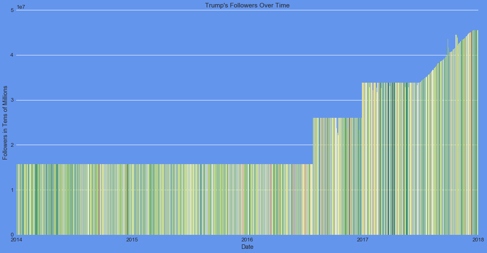
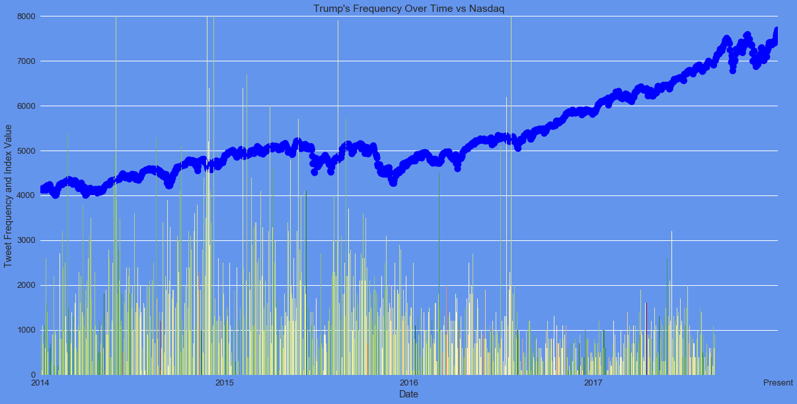
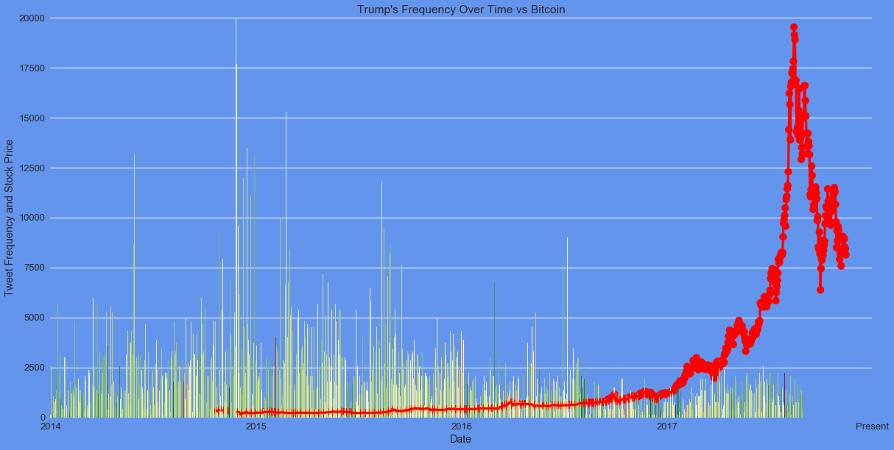

# Trump Tweets and Bitcoin Data


```python
import matplotlib as mpl
import matplotlib.pyplot as plt
import matplotlib.ticker as ticker
import seaborn as sns
import pandas as pd
import numpy as np

from datetime import datetime
```

## Data Collection and Cleaning


```python
trump_tweet = pd.read_csv('cleaned_merged.csv')
final_data = pd.read_csv('full_merged.csv')
```


```python
final_data.head()
```


<div>
<style scoped>
    .dataframe tbody tr th:only-of-type {
        vertical-align: middle;
    }

    .dataframe tbody tr th {
        vertical-align: top;
    }

    .dataframe thead th {
        text-align: right;
    }
</style>
<table border="1" class="dataframe">
  <thead>
    <tr style="text-align: right;">
      <th></th>
      <th>Unnamed: 0</th>
      <th>Date</th>
      <th>Avg_Compound</th>
      <th>Avg_Followers</th>
      <th># of Text</th>
      <th>Nasdaq_close</th>
      <th>Dow_close</th>
      <th>BTC_close</th>
      <th>SP_close</th>
    </tr>
  </thead>
  <tbody>
    <tr>
      <th>0</th>
      <td>0</td>
      <td>2014-01-01</td>
      <td>0.000000</td>
      <td>1.566594e+07</td>
      <td>1.0</td>
      <td>NaN</td>
      <td>NaN</td>
      <td>NaN</td>
      <td>NaN</td>
    </tr>
    <tr>
      <th>1</th>
      <td>1</td>
      <td>2014-01-02</td>
      <td>0.343806</td>
      <td>1.566728e+07</td>
      <td>17.0</td>
      <td>4143.0698</td>
      <td>16441.3496</td>
      <td>NaN</td>
      <td>1831.98</td>
    </tr>
    <tr>
      <th>2</th>
      <td>2</td>
      <td>2014-01-03</td>
      <td>0.484567</td>
      <td>1.566675e+07</td>
      <td>9.0</td>
      <td>4131.9102</td>
      <td>16469.9902</td>
      <td>NaN</td>
      <td>1831.37</td>
    </tr>
    <tr>
      <th>3</th>
      <td>3</td>
      <td>2014-01-04</td>
      <td>-0.250000</td>
      <td>1.566544e+07</td>
      <td>1.0</td>
      <td>NaN</td>
      <td>NaN</td>
      <td>NaN</td>
      <td>NaN</td>
    </tr>
    <tr>
      <th>4</th>
      <td>4</td>
      <td>2014-01-05</td>
      <td>0.734600</td>
      <td>1.566769e+07</td>
      <td>1.0</td>
      <td>NaN</td>
      <td>NaN</td>
      <td>NaN</td>
      <td>NaN</td>
    </tr>
  </tbody>
</table>
</div>


## Data Analysis


```python
x = ['2013','2014','2015','2016','2017','2018']

sns.set(rc={'figure.figsize':(20,10),'axes.facecolor':'cornflowerblue', 'figure.facecolor':'cornflowerblue'})
g=sns.barplot(x=trump_tweet.Date, y=trump_tweet['Avg_Compound'], palette=mpl.cm.ScalarMappable(cmap='RdYlGn').to_rgba(trump_tweet['Avg_Compound']))

g.xaxis.set_major_locator(ticker.MultipleLocator(359))
g.xaxis.set_major_formatter(ticker.FixedFormatter(x))

plt.title(f"Trump's Polarity Over Time")
plt.ylabel("Tweet Polarity")
plt.ylim(-1,1)
plt.show()
 
```


```python
x = ['2013','2014','2015','2016','2017','2018']

sns.set(rc={'figure.figsize':(20,10),'axes.facecolor':'cornflowerblue', 'figure.facecolor':'cornflowerblue'})
g=sns.barplot(x=trump_tweet.Date, y=trump_tweet.Avg_Followers, palette=mpl.cm.ScalarMappable(cmap='RdYlGn').to_rgba(trump_tweet['Avg_Compound']))

g.xaxis.set_major_locator(ticker.MultipleLocator(359))
g.xaxis.set_major_formatter(ticker.FixedFormatter(x))

plt.title(f"Trump's Followers Over Time")
plt.ylabel("Tweet Polarity")
plt.ylim(0,50000000)
plt.show()
```





```python
x = ['2013','2014','2015','2016','2017','Present']

sns.set(rc={'figure.figsize':(20,10),'axes.facecolor':'cornflowerblue', 'figure.facecolor':'cornflowerblue'})
g=sns.pointplot(x=final_data.Date, y=final_data['Nasdaq_close'],color='blue')
g=sns.barplot(x=final_data.Date, y=final_data['# of Text']*100, palette=mpl.cm.ScalarMappable(cmap='RdYlGn').to_rgba(trump_tweet['Avg_Compound']))

g.xaxis.set_major_locator(ticker.MultipleLocator(396))
g.xaxis.set_major_formatter(ticker.FixedFormatter(x))

plt.title(f"Trump's Frequency Over Time vs Bitcoin")
plt.ylabel("Tweet Frequency and Bitcoin Price")
plt.ylim(0,8000)
plt.show()
```





```python
x = ['2013','2014','2015','2016','2017','Present']

sns.set(rc={'figure.figsize':(20,10),'axes.facecolor':'cornflowerblue', 'figure.facecolor':'cornflowerblue'})
g=sns.pointplot(x=final_data.Date, y=final_data['Dow_close'],color='green')
g=sns.barplot(x=final_data.Date, y=final_data['# of Text']*300, palette=mpl.cm.ScalarMappable(cmap='RdYlGn').to_rgba(trump_tweet['Avg_Compound']))

g.xaxis.set_major_locator(ticker.MultipleLocator(396))
g.xaxis.set_major_formatter(ticker.FixedFormatter(x))

plt.title(f"Trump's Frequency Over Time vs Bitcoin")
plt.ylabel("Tweet Frequency and Bitcoin Price")
plt.ylim(0,30000)
plt.show()
```


```python
x = ['2013','2014','2015','2016','2017','Present']

sns.set(rc={'figure.figsize':(20,10),'axes.facecolor':'cornflowerblue', 'figure.facecolor':'cornflowerblue'})
g=sns.pointplot(x=final_data.Date, y=final_data['SP_close'],color='yellow')
g=sns.barplot(x=final_data.Date, y=final_data['# of Text']*30, palette=mpl.cm.ScalarMappable(cmap='RdYlGn').to_rgba(trump_tweet['Avg_Compound']))

g.xaxis.set_major_locator(ticker.MultipleLocator(396))
g.xaxis.set_major_formatter(ticker.FixedFormatter(x))

plt.title(f"Trump's Frequency Over Time vs Bitcoin")
plt.ylabel("Tweet Frequency and Bitcoin Price")
plt.ylim(0,3000)
plt.show()
```


```python
x = ['2013','2014','2015','2016','2017','Present']

sns.set(rc={'figure.figsize':(20,10),'axes.facecolor':'cornflowerblue', 'figure.facecolor':'cornflowerblue'})
g=sns.pointplot(x=final_data.Date, y=final_data['BTC_close'],color='red')
g=sns.barplot(x=final_data.Date, y=final_data['# of Text']*150, palette=mpl.cm.ScalarMappable(cmap='RdYlGn').to_rgba(trump_tweet['Avg_Compound']))

g.xaxis.set_major_locator(ticker.MultipleLocator(396))
g.xaxis.set_major_formatter(ticker.FixedFormatter(x))

plt.title(f"Trump's Frequency Over Time vs Bitcoin")
plt.ylabel("Tweet Frequency and Bitcoin Price")
plt.ylim(0,20000)
plt.show()
 
```




